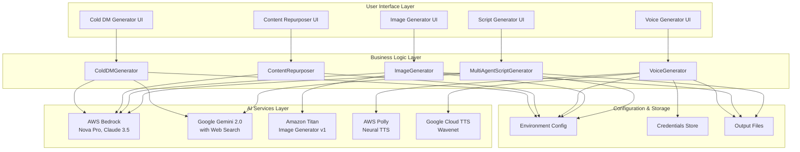
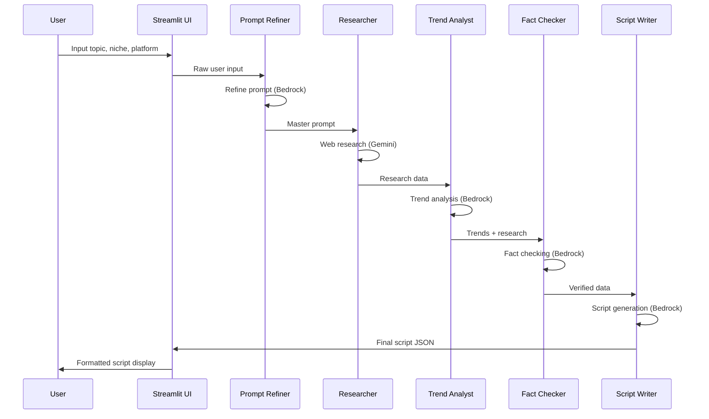

# Design Document

## Overview

Bharat Creator AI is architected as a modular, multi-agent AI system that provides specialized content creation tools for Indian creators. The system follows a microservices-inspired approach where each tool operates independently while sharing common infrastructure patterns. The design emphasizes cultural relevance, multi-language support, and platform-specific optimization through sophisticated AI agent orchestration.

## Architecture

### High-Level System Architecture



### Module Architecture Pattern

Each module follows a consistent two-layer architecture:

1. **Presentation Layer** (`app.py`): Streamlit-based UI handling user input, display, and file operations
2. **Business Logic Layer** (`engine.py`): Core AI agent orchestration, API integration, and data processing

### Multi-Agent Pipeline Design

The system implements sophisticated multi-agent workflows:

**Script Generator (5-Agent Sequential Pipeline)**:


## Components and Interfaces

### Core Components

#### 1. MultiAgentScriptGenerator
- **Purpose**: Orchestrates 5-agent pipeline for viral script creation
- **Key Methods**:
  - `generate_script()`: Main orchestration method
  - `_call_bedrock()`: AWS Bedrock API integration
  - `_call_gemini()`: Google Gemini API with web search
- **Data Structures**: 
  - `TRENDS_DATA`: Curated Indian niche trends (7 categories)
  - `PLATFORM_SPECS`: Platform-specific constraints and formats

#### 2. ImageGenerator
- **Purpose**: Dual-agent image generation with prompt optimization
- **Key Methods**:
  - `generate_image()`: Main generation workflow
  - `_invoke_claude()`: Prompt refinement via Claude
  - `_invoke_titan()`: Image generation via Titan
- **Data Structures**:
  - `STYLE_PRESETS`: 7 predefined visual styles
  - `SIZE_OPTIONS`: 6 platform-optimized dimensions

#### 3. VoiceGenerator
- **Purpose**: Multi-service TTS with language routing
- **Key Methods**:
  - `generate_voice()`: Main TTS orchestration
  - `_generate_polly_voice()`: AWS Polly integration
  - `_generate_google_voice()`: Google Cloud TTS integration
- **Routing Logic**: Hindi/English → Polly, Regional languages → Google TTS

#### 4. ContentRepurposer
- **Purpose**: Single-agent multi-platform content transformation
- **Key Methods**:
  - `repurpose_content()`: Main repurposing workflow
  - `_format_for_platform()`: Platform-specific formatting
- **Output Formats**: Instagram Carousel, Twitter Thread, LinkedIn Post, YouTube Shorts

#### 5. ColdDMGenerator
- **Purpose**: Two-step personalized outreach generation
- **Key Methods**:
  - `generate_cold_dm()`: Main DM generation workflow
  - `_research_brand()`: Optional web research via Gemini
  - `_generate_dm_content()`: Structured DM creation

### External Service Interfaces

#### AWS Bedrock Integration
```python
class BedrockClient:
    def __init__(self):
        self.client = boto3.client('bedrock-runtime')
    
    def converse(self, model_id: str, messages: List[Dict]) -> Dict:
        # Standardized Converse API calls for text generation
        
    def invoke_model(self, model_id: str, body: Dict) -> bytes:
        # Direct model invocation for image generation
```

#### Google Services Integration
```python
class GoogleServicesClient:
    def __init__(self):
        self.gemini_client = genai.GenerativeModel()
        self.tts_client = texttospeech.TextToSpeechClient()
    
    def generate_with_search(self, prompt: str) -> str:
        # Gemini with Google Search grounding
        
    def synthesize_speech(self, text: str, language: str) -> bytes:
        # Multi-language TTS synthesis
```

## Data Models

### Script Generation Data Model
```python
@dataclass
class ScriptOutput:
    hook: str
    main_content: List[str]
    call_to_action: str
    hashtags: List[str]
    metadata: Dict[str, Any]
    agent_outputs: Dict[str, Any]
    
@dataclass
class TrendData:
    niche: str
    trending_topics: List[str]
    hashtags: List[str]
    optimal_format: str
    best_time: str
    engagement_tip: str
```

### Image Generation Data Model
```python
@dataclass
class ImageRequest:
    description: str
    style: str
    size: str
    auto_refine: bool
    
@dataclass
class ImageOutput:
    image_bytes: bytes
    refined_prompt: str
    negative_prompt: str
    generation_metadata: Dict[str, Any]
```

### Voice Generation Data Model
```python
@dataclass
class VoiceRequest:
    text: str
    language: str
    mood: str
    service_preference: Optional[str]
    
@dataclass
class VoiceOutput:
    audio_bytes: bytes
    service_used: str
    voice_id: str
    synthesis_metadata: Dict[str, Any]
```

### Content Repurposing Data Model
```python
@dataclass
class RepurposedContent:
    instagram_carousel: List[str]
    twitter_thread: List[str]
    linkedin_post: str
    youtube_shorts_script: List[Dict[str, str]]  # timestamp + content
    
@dataclass
class PlatformConstraints:
    max_length: int
    hashtag_limit: int
    format_requirements: List[str]
```

### Cold DM Data Model
```python
@dataclass
class ColdDMOutput:
    hook: str
    value_proposition: str
    pitch: str
    call_to_action: str
    full_dm: str
    follow_up: str
    subject_line: str
    outreach_tips: List[str]
    
@dataclass
class BrandResearch:
    company_name: str
    recent_campaigns: List[str]
    brand_values: List[str]
    target_audience: str
    research_sources: List[str]
```

## Error Handling

### Error Classification and Response Strategy

#### 1. API Service Errors
- **AWS Bedrock Throttling**: Implement exponential backoff with jitter
- **Google API Quota Exceeded**: Graceful degradation with user notification
- **Authentication Failures**: Clear error messages with credential check guidance

#### 2. Content Processing Errors
- **Invalid Input Format**: Input validation with specific error messages
- **Content Too Long**: Automatic chunking or user guidance for length limits
- **Language Not Supported**: Fallback to supported languages with user notification

#### 3. File Operation Errors
- **Credential File Missing**: Detailed setup instructions
- **Output Directory Issues**: Automatic directory creation with fallback paths
- **Download Failures**: Retry mechanism with alternative formats

### Error Handling Implementation
```python
class AIServiceError(Exception):
    def __init__(self, service: str, error_code: str, message: str):
        self.service = service
        self.error_code = error_code
        self.message = message
        super().__init__(f"{service} Error [{error_code}]: {message}")

class ErrorHandler:
    @staticmethod
    def handle_api_error(error: Exception, service: str) -> str:
        # Standardized error handling across all modules
        
    @staticmethod
    def retry_with_backoff(func, max_retries: int = 3):
        # Exponential backoff retry mechanism
```

## Testing Strategy

### Unit Testing Approach

#### 1. Component Testing
- **AI Agent Logic**: Mock external API calls, test agent orchestration
- **Data Processing**: Validate input/output transformations
- **Configuration Loading**: Test environment variable handling

#### 2. Integration Testing
- **API Integration**: Test actual service calls with test credentials
- **End-to-End Workflows**: Validate complete user journeys
- **Cross-Module Dependencies**: Test shared configuration and utilities

#### 3. UI Testing
- **Streamlit Components**: Test form validation and display logic
- **File Operations**: Test upload/download functionality
- **Error Display**: Validate error message presentation

### Testing Infrastructure
```python
# Test configuration
@pytest.fixture
def mock_bedrock_client():
    with patch('boto3.client') as mock:
        yield mock

@pytest.fixture
def sample_script_data():
    return {
        "topic": "Indian street food",
        "niche": "food",
        "platform": "instagram",
        "duration": "30",
        "language": "hindi"
    }

# Integration test example
def test_script_generation_pipeline(mock_bedrock_client, sample_script_data):
    generator = MultiAgentScriptGenerator()
    result = generator.generate_script(**sample_script_data)
    
    assert result.hook is not None
    assert len(result.hashtags) > 0
    assert result.metadata['niche'] == 'food'
```

### Performance Testing
- **Response Time Benchmarks**: Target <30 seconds for script generation
- **Concurrent User Testing**: Validate system behavior under load
- **Resource Usage Monitoring**: Memory and CPU utilization tracking

### Security Testing
- **Credential Exposure**: Ensure no API keys in logs or error messages
- **Input Sanitization**: Validate all user inputs for injection attacks
- **File Security**: Test upload/download security measures

## Design Decisions and Rationales

### 1. Multi-Agent Architecture
**Decision**: Implement specialized agents for different tasks rather than single large models
**Rationale**: 
- Better task specialization and accuracy
- Easier debugging and maintenance
- Ability to optimize each agent independently
- Clear separation of concerns

### 2. Hybrid AI Service Strategy
**Decision**: Use both AWS Bedrock and Google Gemini services
**Rationale**:
- Bedrock excels at structured content generation with reliable JSON output
- Gemini provides unique web search grounding capabilities
- Service redundancy and fallback options
- Cost optimization through service-specific strengths

### 3. Independent Module Deployment
**Decision**: Each tool operates as a standalone Streamlit application
**Rationale**:
- Simplified deployment and maintenance
- Users can access only needed tools
- Independent scaling and updates
- Reduced system complexity

### 4. Cultural Localization Strategy
**Decision**: Embed Indian cultural context directly in the system
**Rationale**:
- Better content relevance for target audience
- Competitive advantage in Indian market
- Improved engagement through cultural understanding
- Authentic language and trend integration

### 5. File-Based Configuration
**Decision**: Use .env files and JSON credentials rather than database configuration
**Rationale**:
- Simplified deployment without database dependencies
- Easy credential management and rotation
- Version control friendly (with proper .gitignore)
- Reduced infrastructure complexity